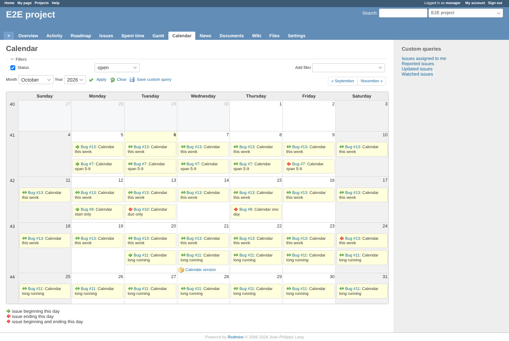
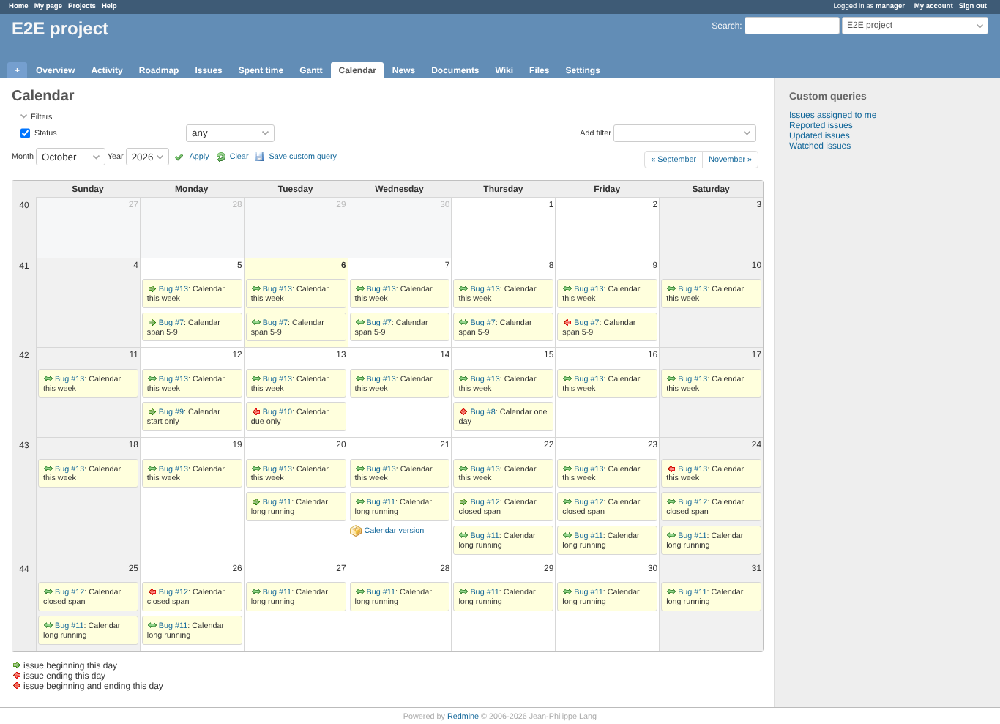
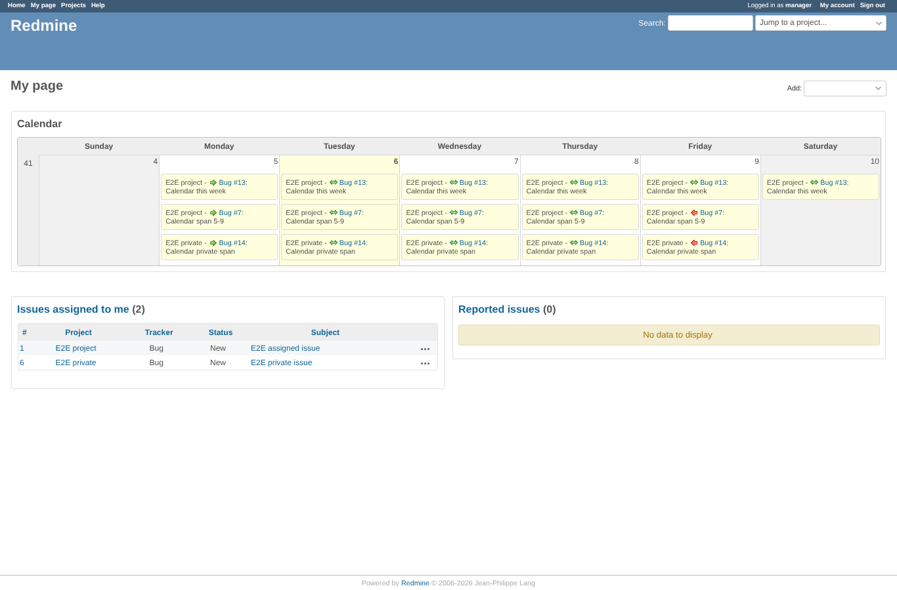

# before

Run 2026-10-06T19:50:14.071Z against http://127.0.0.1:3001.

| screenshot | user | URL | shows |
|---|---|---|---|
|  | manager | `/projects/e2e-project/issues/calendar` | Before (master on Redmine 5.1): between days marked with the PNG "between" icon, start/end with PNG bullets; no legend line for "between" |
|  | manager | `/projects/e2e-project/issues/calendar?set_filter=1&f[]=status_id&op[status_id]=*` | Before: with status "any" the closed issue is shown, its link not struck through (the plugin's global link rule removed it) |
|  | manager | `/my/page` | Before: My page week calendar block with between entries |
