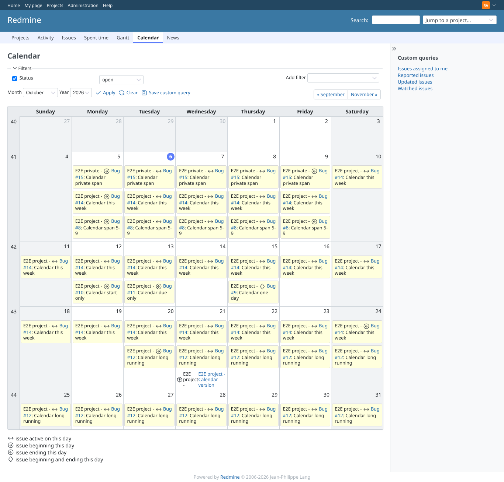
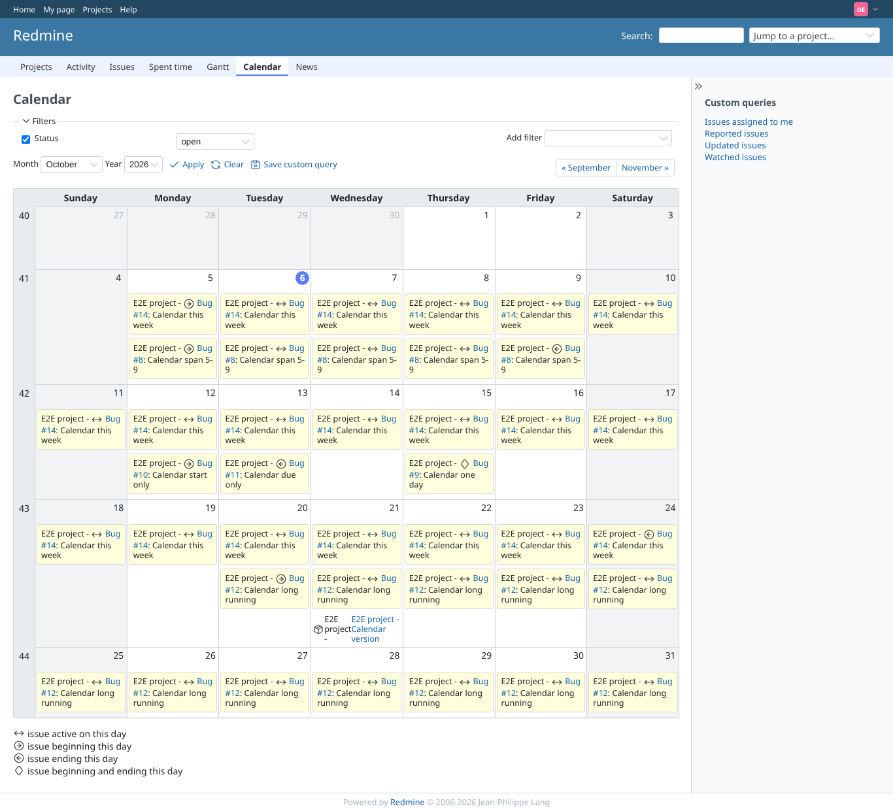

# global-calendar

Run 2026-10-06T19:39:08.199Z against http://127.0.0.1:3000.

| screenshot | user | URL | shows |
|---|---|---|---|
|  | admin | `/issues/calendar` | Admin, all projects: between entries of both projects, each prefixed with the project name (E2E project / E2E private) |
|  | outsider | `/issues/calendar` | Outsider, all projects: only the public project; the private issue is on no day, also not as between |
