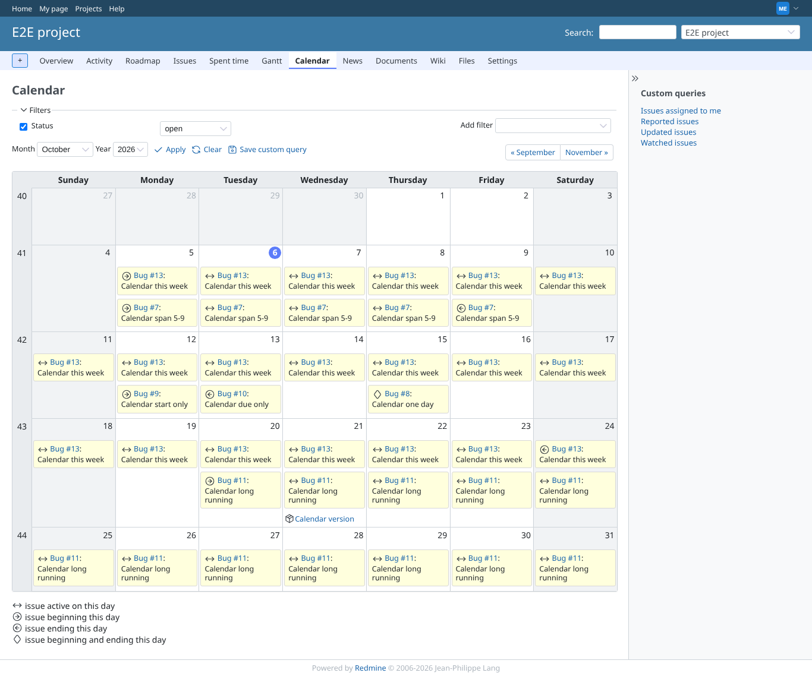
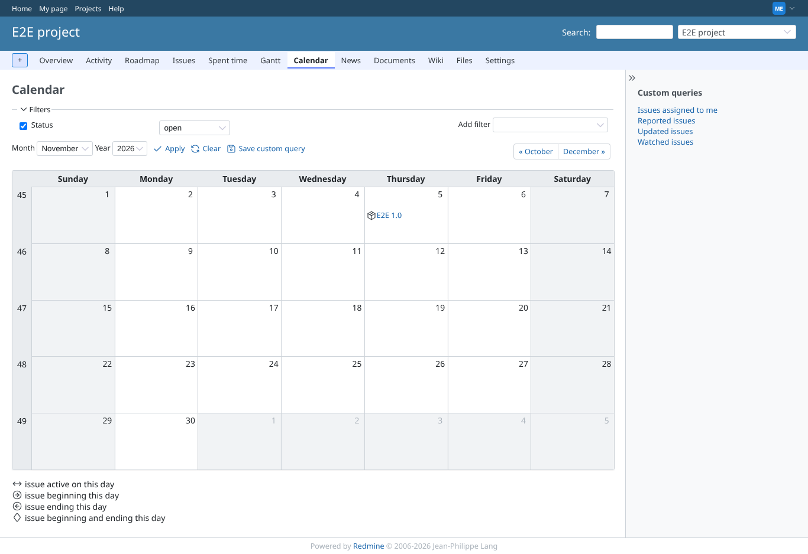
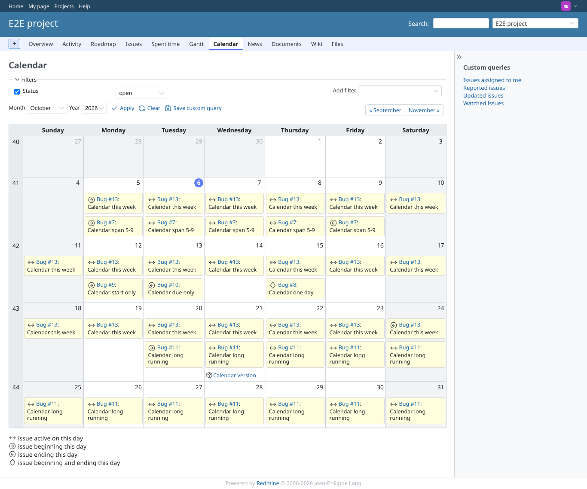
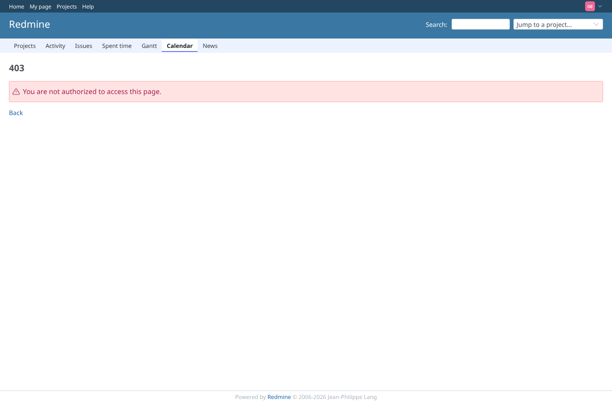

# project-calendar

Run 2026-10-06T19:42:35.481Z against http://127.0.0.1:3000 (MariaDB 10.11).

| screenshot | user | URL | shows |
|---|---|---|---|
|  | manager | `/projects/e2e-project/issues/calendar` | Manager: "Calendar span 5-9" on 5 (start), 6-8 (between, arrows icon), 9 (end); one-day issue on 15 with the diamond; version on 21 with the package icon; legend lists "issue active on this day"; today has the Redmine 7 circle |
|  | manager | `/projects/e2e-project/issues/calendar?year=2026&month=11` | Next month: "Calendar long running" neither starts nor ends in view, so core does not fetch it and it is absent (limitation as on master, recorded in the plan) |
|  | reporter | `/projects/e2e-project/issues/calendar` | Reporter: same calendar, same between days; the plugin adds no permission of its own |
|  | outsider | `/projects/e2e-private/issues/calendar` | Outsider: the private project calendar is refused with 403, nothing of the private issue shows |
|  | anonymous | `/login?back_url=http%3A%2F%2F127.0.0.1%3A3000%2Fprojects%2Fe2e-private%2Fissues%2Fcalendar` | Anonymous: the private project calendar redirects to the login page |
