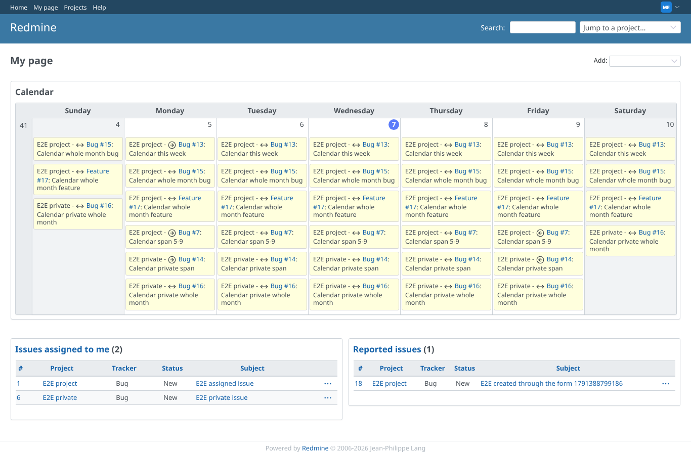
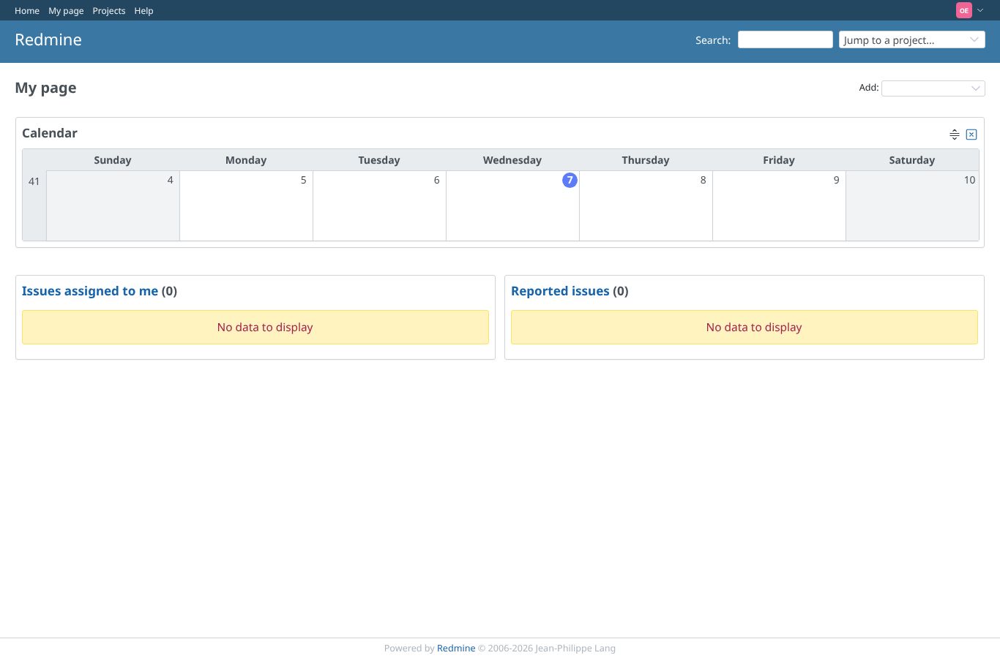

# my-page-calendar

Run 2026-10-07T16:00:35.880Z against http://127.0.0.1:3000.

| screenshot | user | URL | shows |
|---|---|---|---|
|  | manager | `/my/page` | Manager, My page: the week calendar block shows "Calendar this week" on its start day and as between on every later day of the week |
|  | outsider | `/my/page` | Outsider, My page: the calendar block is there but empty, no issue of any project, private or public (core lists member projects only) |
