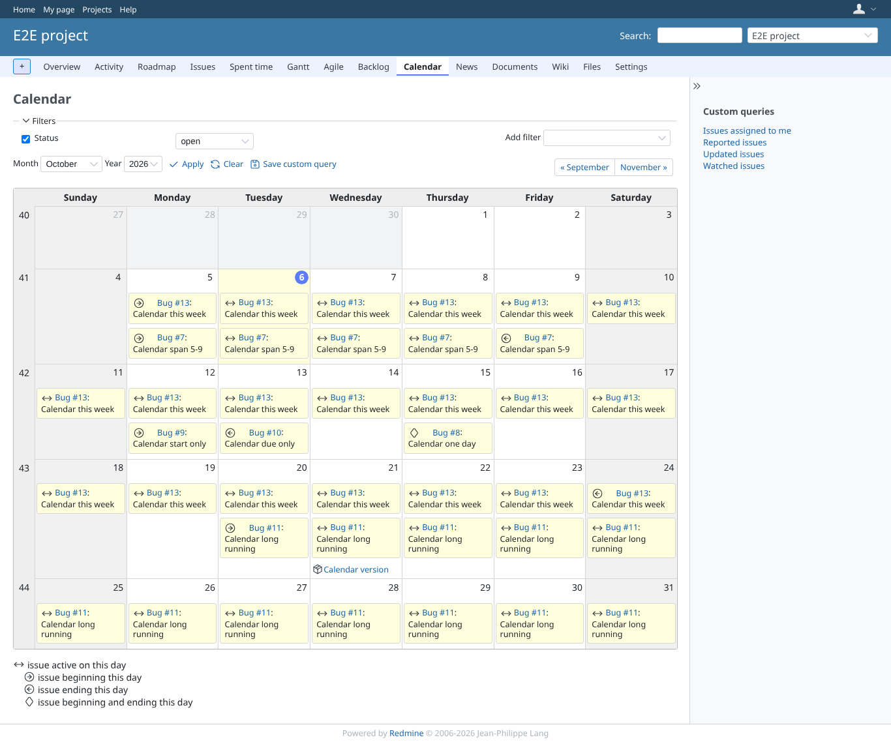

# project-calendar

Run 2026-10-07T16:15:41.560Z against http://127.0.0.1:3002 (PostgreSQL 16, with 40 other GEOxyz plugins on redmine70-migration, all but redmine_issue_field_visibility and redmine_tint_issues).

| screenshot | user | URL | shows |
|---|---|---|---|
|  | manager | `/projects/e2e-project/issues/calendar` | Manager: "Calendar span 5-9" on 5 (start), 6-8 (between, arrows icon), 9 (end); one-day issue on 15 with the diamond; version on 21 with the package icon; legend lists "issue active on this day"; today has the Redmine 7 circle |
|  | manager | `/projects/e2e-project/issues/calendar?year=2026&month=11` | Next month: "Calendar long running" (started this month, due in three years) is on every day in view as between; before 2026-10-07 core did not fetch it |
|  | reporter | `/projects/e2e-project/issues/calendar` | Reporter: same calendar, same between days; the plugin adds no permission of its own |
|  | outsider | `/projects/e2e-private/issues/calendar` | Outsider: the private project calendar is refused with 403, nothing of the private issue shows |
|  | anonymous | `/login?back_url=http%3A%2F%2F127.0.0.1%3A3002%2Fprojects%2Fe2e-private%2Fissues%2Fcalendar` | Anonymous: the private project calendar redirects to the login page |

## Problems

- login manager: 404 image /assets/plugin_assets/redmineup/bullet_go.png
- login manager: 404 image /assets/plugin_assets/redmineup/bullet_end.png
- /projects/e2e-project/issues/calendar as manager: 404 image /assets/plugin_assets/redmineup/bullet_diamond.png
- /projects/e2e-project/issues/calendar as reporter: 404 image /assets/plugin_assets/redmineup/bullet_go.png
- /projects/e2e-project/issues/calendar as reporter: 404 image /assets/plugin_assets/redmineup/bullet_end.png
- /projects/e2e-project/issues/calendar as reporter: 404 image /assets/plugin_assets/redmineup/bullet_diamond.png
- /projects/e2e-project/issues/calendar as outsider: 404 image /assets/plugin_assets/redmineup/bullet_go.png
- /projects/e2e-project/issues/calendar as outsider: 404 image /assets/plugin_assets/redmineup/bullet_diamond.png
- /projects/e2e-project/issues/calendar as outsider: 404 image /assets/plugin_assets/redmineup/bullet_end.png
