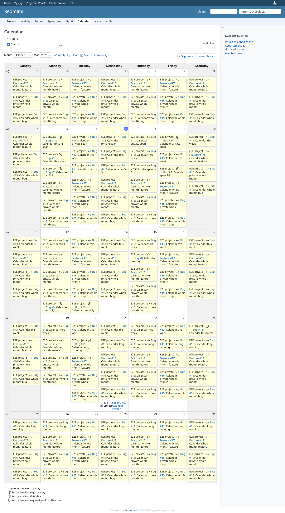

# spanning-issues

Run 2026-10-07T16:17:56.431Z against http://127.0.0.1:3002 (PostgreSQL 16, with 40 other GEOxyz plugins on redmine70-migration, all but redmine_issue_field_visibility and redmine_tint_issues).

| screenshot | user | URL | shows |
|---|---|---|---|
|  | admin | `/issues/calendar` | Admin, all projects: "Calendar whole month" and "Calendar private whole month" (start last month, due next month) on every day as between |
|  | manager | `/projects/e2e-project/issues/calendar` | Manager, project calendar: the whole-month issue and feature run through every day of the month; before the change they were missing |
|  | manager | `/projects/e2e-project/issues/calendar?set_filter=1&f[]=status_id&op[status_id]=o&f[]=tracker_id&op[tracker_id]=%3D&v[tracker_id][]=1` | Manager, filter tracker = Bug: the whole-month Feature is gone, the whole-month Bug stays; the added issues follow the query |
|  | manager | `/my/page` | Manager, My page: the week block shows both whole-month issues on all seven days |
|  | reporter | `/projects/e2e-project/issues/calendar` | Reporter (core Reporter role): sees the whole-month issues of the public project like every other issue |
|  | reporter | `/projects/e2e-private/issues/calendar` | Reporter in E2E private without "View calendar": the private calendar is refused (403), also with the change |
|  | reporter | `/issues/calendar` | Reporter, all projects: issues of E2E private are listed because the reporter may view its issues (core rule for the cross-project calendar); the whole-month issue follows the same rule as the private span |
|  | outsider | `/issues/calendar` | Outsider, all projects: the public whole-month issues on every day, nothing of the private project |
|  | outsider | `/projects/e2e-private/issues/calendar` | Outsider: the private project calendar is refused (403) |
|  | outsider | `/my/page` | Outsider, My page: the week block stays empty, as core (member projects only) |

## Problems

- /issues/calendar as admin: 404 image /assets/plugin_assets/redmineup/bullet_go.png
- /issues/calendar as admin: 404 image /assets/plugin_assets/redmineup/bullet_end.png
- /issues/calendar as admin: 404 image /assets/plugin_assets/redmineup/bullet_diamond.png
- login manager: 404 image /assets/plugin_assets/redmineup/bullet_go.png
- login manager: 404 image /assets/plugin_assets/redmineup/bullet_end.png
- /projects/e2e-project/issues/calendar as manager: 404 image /assets/plugin_assets/redmineup/bullet_diamond.png
- /projects/e2e-project/issues/calendar as reporter: 404 image /assets/plugin_assets/redmineup/bullet_go.png
- /projects/e2e-project/issues/calendar as reporter: 404 image /assets/plugin_assets/redmineup/bullet_diamond.png
- /projects/e2e-project/issues/calendar as reporter: 404 image /assets/plugin_assets/redmineup/bullet_end.png
- /issues/calendar as outsider: 404 image /assets/plugin_assets/redmineup/bullet_go.png
- /issues/calendar as outsider: 404 image /assets/plugin_assets/redmineup/bullet_diamond.png
- /issues/calendar as outsider: 404 image /assets/plugin_assets/redmineup/bullet_end.png
